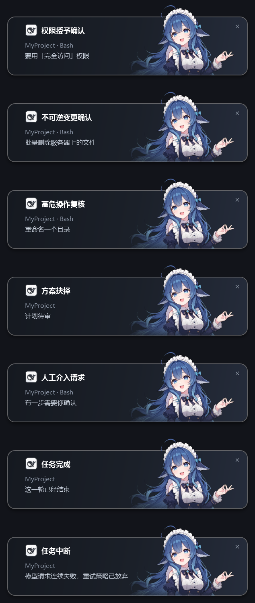

# dsh-notify

**DSH 的「你不在的时候」提醒插件。** 当你在别的窗口、或把 DSH 最小化时，一旦有事情需要你介入，屏幕角落会弹出一张置顶卡片；**点一下，DSH 被拉到前台并自动跳到那个会话。**



卡片是原生 WPF 窗口：无边框、置顶、**不抢焦点**（不打断你正在做的事）、点击穿透（鼠标移到卡片上才可交互）。

---

## 它替你看着什么

卡片固定三行：**分类标题 / 会话名 · 工具名 / 具体情况**。

| 第一行（分类） | 什么时候出现 | 第三行 |
|---|---|---|
| **权限授予确认** | 需要你批准某个权限，含沙箱升级 | `请求「完全访问」权限`（三种模式：只读 / 工作区内修改 / 完全访问） |
| **方案抉择** | DSH 准备好方案，等你点头 | `计划已就绪，待你确认` |
| **不可逆变更确认** | 措辞里带「批量 / 不可逆 / 永久 / 清空 / 格式化 / 覆盖 / `rm -rf` …」 | 从 DSH 给出的文案里抽出的短句 |
| **高危操作复核** | 措辞里带「删除 / 移除 / 清除 / 重命名 / delete / drop …」 | 同上 |
| **人工介入请求** | 其它需要你确认的事 | 抽不出可靠短句时用 `待你确认后继续` |
| **任务完成** | 一轮任务正常结束 | `本轮已完成` |
| **任务中断** | 任务出错且无法自愈 | `执行出错，无法自动恢复` |

> 措辞原则：标题写死为分类名（卡片只回答「现在是什么情况」）；
> 抽不出可靠短句时一律落到兜底 —— **宁可少喊，也不乱喊**。
> `修改` / `写入` **故意不算高危**：几乎每个写操作都命中，加进去只会变噪音。

有多项在等待时，第三行会带上总数：`请求「完全访问」权限（共 2 项待确认）`。

## 核心行为：只在你看不到的时候打扰

这是本插件与「什么都弹」的根本区别：

| 你的状态 | 行为 |
|---|---|
| **正在看 DSH**（窗口可见、页面仍在上报） | **完全不打扰**；待处理的审批 / 提问进入挂起队列 |
| **把 DSH 最小化 / 被别的窗口完全遮住** | **弹出卡片**；挂起队列里的一并提醒 |
| **窗口开着，但你去了别的程序** | 同第一行 —— 上报停了就说明你不在看 |

判据是「**页面的上报是否还在继续**」，而不是单纯的焦点或可见性。
原因：窗口被最小化 / 遮挡时 Chromium 会**冻结渲染进程**，`visibilitychange`
的上报可能根本发不出来 —— 只有「上报停了」能识别出来。

多张卡片同时到达时按**队列**处理：屏幕一次只显示最新的一张，其余排队，
第三行告诉你一共几项在等；处理掉一项，下一项自动顶上。
**你点了卡片又回到页面时，剩余卡片不会弹到你脸上**，而是回到队列等你下次离开。

## 安装

需要 Windows（卡片助手基于 WPF + PowerShell 5.1）。

```powershell
dsh plugin --profile desktop add "https://github.com/InkyFeather/dsh-notify.git"
```

也可以写成简写 `github:InkyFeather/dsh-notify`。要锁定版本就在末尾加 `#<tag 或 commit>`，
例如 `"https://github.com/InkyFeather/dsh-notify.git#v0.1.0"`。

或者让 DSH 里的 Agent 用 `plugin_manager` 工具执行 `install_bundle`，
`target` 传上面这个安装源即可 —— 它接受 git 仓库 URL、`github:` 简写或 tarball。

> 本插件**没有构建步骤**（客户端半是纯 JS，由页面的模块加载器直接加载），
> 所以 git 安装不会触发 pnpm 的 `prepare` 构建白名单提示。

**卸载**：用 `plugin_manager` 的 `remove_bundle`，或从 profile 的 `dependencies` 中删掉 `dsh-notify`。

## 设置

三种途径，**优先级：`settings.json` > profile 的 `config` > 内置默认**。
每条 `[apply]` 日志里的 `settingsSource` 会告诉你**最后是谁说了算**。

### 1. 设置文件（推荐）

复制到 **用户级位置** `$DSH_HOME/dsh-notify.json`（默认 `C:\Users\<你>\.dsh\dsh-notify.json`）：

```powershell
Copy-Item settings.example.json "$env:USERPROFILE\.dsh\dsh-notify.json"
```

> 为什么不放插件目录：从 git / npm 安装时插件本体在 `node_modules/dsh-notify/` 里，
> 放那儿**重装插件就会被整个替换掉**。
> 插件目录的 `settings.json` 也仍会被读取（作为回退）；两个都存在时以 `$DSH_HOME`
> 下的为准。每次 `[apply]` 日志里的 `settingsPath` 会告诉你**实际读的是哪个文件**。

| 键 | 默认 | 说明 |
|---|---|---|
| `enabled` | `true` | 总开关 |
| `mute` | 全 `false` | 按分类静音；最常想关掉的是 `completed`（每轮结束都提示一次） |
| `ignoreSubagents` | `true` | 忽略**子代理会话**的一次性通知。⚠️ **不影响审批与提问** —— 子代理同样可能触发审批，静音它会让你永远收不到 |
| `quietOnFocusOnly` | `false` | `true` = 退回「只看键盘焦点」的旧规则 |
| `autoDismissSeconds` | `0` | 卡片自动消失秒数；`0` = 不自动消失 |

改完**需要一次插件重载才生效** —— HMR 只监视 `.js`，不监视 `.json`。
最省事的触发方式：改一下 `lib/index.js` 里的 `BUILD` 字符串（保存即重载）。
**删掉 `settings.json` 即恢复默认值。**

### 2. DSH 设置界面

插件声明了 `Config` schema，设置界面会据此派生，字段与上表一致。

### 3. profile 的 `cordis.patch.yml`

```yaml
- id: dsh-notify
  config:
    mute: { completed: true }
```

## 它是怎么工作的

```
DSH 宿主进程（Node）
  ├─ 事件钩子   approval/request · tool/call(ask_user_question) · turn/end · agent/error
  ├─ 决策层     抑制 → 分类 → 去重 → 队列 → 挂起 → 收起
  └─ 卡片助手   powershell.exe -STA helper.ps1   （JSON over stdin/stdout）
        └─ WPF 置顶窗口 + 点击 → 把 DSH 拉回前台
页面侧（客户端半）
  └─ 每 2 秒上报 {focused, visible}；消费「待打开会话」并跳转
```

- **宿主半不知道窗口状态**，所以由页面侧上报；上报停止即推断「你不在看」。
- **宿主进程没有 Electron API**（它是普通 Node），所以卡片走独立 PowerShell 进程。
- 助手**懒启动**：第一次要弹卡片时才拉起 PowerShell（冷启动 2–4 秒，期间卡片排队、就绪后补发）。
- 点击卡片不直接导航 —— 先把 DSH 窗口拉到前台，页面拿到焦点后自己去取
  「待打开的会话」并跳转（绕开了隐藏窗口里定时器被节流的问题）。

## 环境要求与已知限制

- **仅 Windows**：卡片助手是 WPF + PowerShell 5.1。
- **Node ≥ 20**（宿主进程实测 v24）。
- **多显示器 / 非 100% DPI 缩放未验证**（开发机只有 1920×1080 @100%）。
- **无声音提醒。**
- 卡片**一次只显示一张**，不做视觉并排堆叠。
- **改了客户端半（`client/client.js`）必须刷新 DSH 页面** —— 客户端模块是页面启动时加载的。

## 文件结构

| 路径 | 说明 |
|---|---|
| `lib/index.js` | 宿主半入口：事件 → 语义的翻译层、HTTP 路由、插件入口 |
| `lib/notify.js` | **决策层**：抑制、去重、挂起、队列、收起、自动消失、点击归属 |
| `lib/classify.js` | 七种分类规则与第三行文案抽取 |
| `lib/config.js` | 设置：`Config` schema + `settings.json` 读取与优先级 |
| `lib/log.js` | 诊断日志 |
| `lib/wpf.js` | 卡片助手生命周期、stdin/stdout 协议、BOM 自愈 |
| `client/client.js` | 客户端半：窗口状态上报 + **点击跳转的落点** |
| `assets/helper.ps1` | WPF 置顶卡片（`-Test` 可单独试跑） |
| `assets/*.png` | 卡片立绘与头像（**运行时加载**） |
| `settings.example.json` | 设置模板，复制为 `settings.json` 使用 |
| `preview/classification-gallery.png` | 上方截图 |
| `cordis.patch.yml` | bundle 挂载声明 |

## 疑难排查

**`pwsh` 报 `SetNamedSecurityInfoW failed (Win32 5): grantWrite(<工作区>)`**

DSH 的 Windows 沙箱在 `workspace-write` 模式下需要给工作区目录**授写 ACL**，
而写完整性标签需要 `WRITE_OWNER`。若目录的权限条目里当前账户没有「完全控制」，
这一步会失败，于是**任何** `pwsh` 命令（包括只读）都起不来，`workflow` 的 worker 也一样。

二选一解决：
1. 给该目录的**权限条目**（不只是「所有者」那一栏）加上当前账户的「完全控制」；
2. 或把 DSH 的文件策略设为 `danger-full-access`（此时沙箱不需要授 ACL）。

**卡片不出现**

看日志 `$DSH_HOME/dsh-notify.log`（默认 `C:\Users\<你>\.dsh\dsh-notify.log`）。
`[suppressed]` 的 `because` 会直接告诉你原因：
`still watching` / `page hidden` / `muted:*` / `subagent session` / `duplicate` / `plugin disabled`。
若连 `[notified]` 都没有，说明事件本身没到达。

**改了 `helper.ps1` 之后卡片起不来**

`helper.ps1` **必须存成 UTF-8 with BOM**。无 BOM 的 UTF-8 会被 PowerShell 5.1
按 ANSI 读，中文字面量乱码、解析直接失败。插件每次拉起助手前会自动补 BOM，
但你自己改完最好确认一下。

## 许可

[MIT](./LICENSE)。
